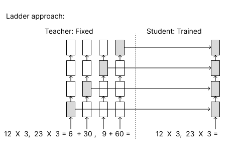
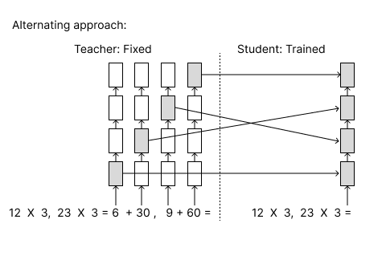

# Implicit Chain of Thought Reasoning Challenge

## Reasoning
### Parallel Arithmetic
Following the hint of using half of the states for each of the problem's CoT, there are several potential ways of achieving this: 

#### 1. Combining the hidden states of two single-arithmetic teacher/emulator   
The first approach that came to my mind is keeping the trained teacher model and emulator model weights as is, and feed them with two single-arithmetic questions. The only model that has to be retrained in this approach is the student model. We could knowledge distill by combining half of the hidden states of the two single-arithmetic teacher/emulator model. The con of this approach, however, is that there is extra overhead due to data processing. We have to process both the double arithmetic data for the student model and the single arithmetic data for the teacher/emulator model. 

#### 2. Retraining teacher model with double arithmetic problems and redesign knowledge distillattion (Chosen Approach)
With the con of the previous approach in mind, I designed the following approach: 
1. Retrain teacher model with double arithmetic CoT
2. Locate teacher model hidden states corresponding to CoT for question 1 and CoT for question 2 respectively. 
3. Knowledge Distill and restructure teacher model hidden states to fit student model layers. 

For the restructuring teacher hidden states part, I have experimented with two approaches:
##### -Ladder



(The arithmetic in the graph is only for illustration purposes. Duo 2 X 2 mult expressions are used in training) 

In the ladder approach, a student model with L layers extract its first L/2 hidden states from teacher's hidden states positions (first EOS position, second coma position), and the latter half from (second coma position, second EOS position) with a fixed interval of delta. 

The rationale behind this construct is letting the student transformers first focus on the CoT of the first arithmetic problem and then focus on the CoT of the second arithmetic problem. 


*The ladder approach at the first glance is very similar to the original Implicit CoT Model with no parallel CoT. The origial arichitecture can achieve something similar if we retrain the teacher model with double aritmetic data and make no changes to the teacher model extraction logic. There is, however, one crucial difference. By locating the comma position and precisely separating data COT, we can train the model to process arithmetic problems with different lengths without worrying about fluctuations of the hidden-state distribution. The original architecture, if used on double computing, also can not precisely separate the CoTs of the two arithmetics due to how GPT2 tokenizes words. The GPT2 tokenizer merges certain character and space pattern into one token, which leads to an uneven number of tokens for arithmetic equations of the same length. The ladder approach, on the other hand, precisely locates the comma position and seperates the corresponding CoTs, which helps the model to digest a more predictive pattern of hidden states.   

##### -Alternating



The alternating approach is a variation of the ladder approach. After splitting teacher's hidden states into corresponding chunks of the first and second CoT, the alternating approach helps the student model to solve the problems step by step "simutaneously". This approach may benefit from the fact that similar arithmetic problems have similar solving steps. The model may learn to streamline the process with similar setups in this approach.  

## Results

## Prerequisites

* [PyTorch](https://pytorch.org/get-started/locally/)
* [transformers](https://github.com/huggingface/transformers) (`pip install transformers`)

## Datasets & Pretrained Models & Logs

For the purpose of the challenge, we use 2 X 2 Mult dataset. (tried 4 X 4 mult, but the training mind-reading student section converges at .78 token accuracy. GPT2-small's architecture is probably insufficient for parallel 4 X 4 Mult)

All dataset files and log files during inference are included in this repo, with the exception of large training files maintained under Git LFS. Model checkpoints are stored on Google Drive. The folder containing all checkpoints can be found at [this link](https://drive.google.com/drive/folders/1Sclr5bmLZIUcktCaFAeWRTevRGLUwlC_?usp=drive_link).

## Usage

We use 2 X 2 Mult with GPT2-Small as an example. We assume that the working directory is `implicit_chain_of_thought` throughout this document.

### Data Format

The format of training, validation, and test files looks like below:

```
[input 1], [intput 2]||[chain-of-thought 1], [chain-of-thought 2] #### [output 1], [output 2]
...
```

Note that for Teacher Training, (a) Mind-Reading the Teacher, and (b) Thought Emulation, the chain-of-thought steps are used; but for (c) Couple and Optimize the chain-of-thought steps are not used.

### Training

#### Prerequisite: Teacher Training

A teacher has to be trained based on the new parallel aritmatic data.

```
export FOLDER=data/2_by_2_mult
export MODEL=gpt2
export EPOCHS=1
export LR=5e-5
export BSZ=16
export SAVE=train_models/2_by_2_mult/gpt2/teacher
echo $SAVE
mkdir -p $SAVE
TOKENIZERS_PARALLELISM=false CUDA_VISIBLE_DEVICES=0 stdbuf -oL -eL python src/train_teacher.py \
    --train_path ${FOLDER}/train.txt \
    --val_path ${FOLDER}/valid.txt \
    --epochs $EPOCHS \
    --lr $LR \
    --batch_size $BSZ \
    --base_model $MODEL \
    --save_model $SAVE \
    > ${SAVE}/log.train 2>&1&
```

#### (a) Mind-Reading the Teacher


```
export FOLDER=data/2_by_2_mult
export DELTA=dynamic
export MODEL=gpt2
export PARALLEL_MODE=ladder
export EPOCHS=40
export LR=5e-5
export BSZ=32
export TEACHER=train_models/2_by_2_mult/gpt2/teacher/checkpoint_0
export SAVE=train_models/2_by_2_mult/gpt2/student_initial
mkdir -p $SAVE
TOKENIZERS_PARALLELISM=false CUDA_VISIBLE_DEVICES=0 stdbuf -oL -eL python src/train_mind_reading_student.py \
    --train_path ${FOLDER}/train.txt \
    --val_path ${FOLDER}/valid.txt \
    --epochs $EPOCHS \
    --lr $LR \
    --batch_size $BSZ \
    --base_model $MODEL \
    --teacher $TEACHER \
    --save_model $SAVE \
    --delta $DELTA \
    --parallel_mode $PARALLEL_MODE \
    > ${SAVE}/log.train 2>&1&
```

#### (b) Thought Emulation


```
export FOLDER=data/2_by_2_mult
export DELTA=dynamic
export MODEL=gpt2
export PARALLEL_MODE=ladder
export EPOCHS=40
export LR=5e-5
export BSZ=32
export MIXTURE_SIZE=1
export TEACHER=train_models/2_by_2_mult/gpt2/teacher/checkpoint_0
export SAVE=train_models/2_by_2_mult/gpt2/emulator_initial
mkdir -p $SAVE
TOKENIZERS_PARALLELISM=false CUDA_VISIBLE_DEVICES=0 stdbuf -oL -eL python src/train_thought_emulator.py \
    --train_path ${FOLDER}/train.txt \
    --val_path ${FOLDER}/valid.txt \
    --epochs $EPOCHS \
    --lr $LR \
    --batch_size $BSZ \
    --base_model $MODEL \
    --teacher $TEACHER \
    --save_model $SAVE \
    --delta $DELTA \
    --mixture_size ${MIXTURE_SIZE} \
    --parallel_mode $PARALLEL_MODE \
    > ${SAVE}/log.train 2>&1&
```

#### (c) Couple and Optimize


```
export FOLDER=data/2_by_2_mult
export EPOCHS=40
export LR=5e-5
export BSZ=32
export STUDENT=train_models/2_by_2_mult/gpt2/student_initial/checkpoint_8
export EMULATOR=train_models/2_by_2_mult/gpt2/emulator_initial/checkpoint_9
export SAVE=train_models/2_by_2_mult/gpt2/
mkdir -p $SAVE
TOKENIZERS_PARALLELISM=false CUDA_VISIBLE_DEVICES=0 stdbuf -oL -eL python src/train_coupled_emulator_and_student.py \
    --train_path ${FOLDER}/train.txt \
    --val_path ${FOLDER}/valid.txt \
    --epochs $EPOCHS \
    --lr $LR \
    --batch_size $BSZ \
    --student $STUDENT \
    --emulator $EMULATOR \
    --save_model $SAVE \
    > ${SAVE}/log.train 2>&1&
```

### Generation & Evaluation

Here we use a pretrained model as an example. Download the folder `models/2_by_2_mult/gpt2`, then the following command will run inference and evaluate both accuracy and throughput, logged in file `generation_logs/2_by_2_mult/log.generate`.

```
export FOLDER=data/2_by_2_mult
export STUDENT=models/2_by_2_mult/gpt2/student
export EMULATOR=models/2_by_2_mult/gpt2/emulator
export BSZ=1
export SAVE=generation_logs/2_by_2_mult
mkdir -p $SAVE
TOKENIZERS_PARALLELISM=false CUDA_VISIBLE_DEVICES=0 stdbuf -oL -eL python src/generate.py \
    --batch_size $BSZ \
    --test_path ${FOLDER}/test_bigbench.txt \
    --student_path $STUDENT \
    --emulator_path $EMULATOR \
    > ${SAVE}/log.generate 2>&1&
```
```
